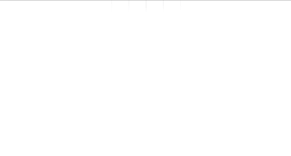

</p>

<h2 align="center">@huds0n/animations</h3>

</p>

<div align="center">

[]()
[](https://github.com/JontiHudson/modules-huds0n-animations/issues)
[](https://github.com/JontiHudson/modules-huds0n-animations/pulls)
[](/LICENSE)

</div>

---

<p align="center">
A collection of animated components, including <b>Animated View</b>, <b>Animated Text</b>, <b>Animated Lists</b>, <b>Transition Containers</b>, and more...
</p>

</br>

## 📝 Table of Contents

- [About](#about)
- [Features](#features)
- [Getting Started](#getting_started)
- [Basic Usage](#basic_usage)
  - [Base Style](#base_style)
  - [Basic Animation](#basic_animation)
  - [Looping](#looping)
  - [Parallel Animations](#parallel)
  - [Sequence Animations](#sequence_animations)
- [Advanced Usage](#advanced_usage)
  - [Create Animated Component](#create_animated_components)
  - [Use Native Driver](#use_native_driver)
  - [Attach Animations](#attach)
- [Reference](#reference)
  - [AnimationProps](#animation_props)
- [Extras](#extras)
  - [ColorFader](#color_fader)
  - [ContentsFader](#contents_fader)
  - [Transition](#transition)
  - [Lists](#lists)
- [Example](#example)
- [Authors](#authors)
- [Acknowledgments](#acknowledgement)

</br>

## 🧐 About <a name = "about"></a>

A simple and declarative way to provide complex, interactive animations for **React Native**.

```jsx
<AnimatedText
  style={{
    color: 'orange',
    fontSize: 48,
  }}
  animate={[
    {
      to: { transform: [{ scale: 1 }] },
      type: 'SPRING',
      bounciness: 10,
      speed: 1,
    },
    {
      to: { color: 'red' },
      duration: 150,
      loop: true,
    },
  ]}
>
  Welcome
</AnimatedText>
```


 
</br>
</br>

## ✅ List of Features <a name = "features"></a>

- **Simple:** _No need to deal with **Animated.Values** to make great animations._
- **Declarative:** _Describe your animations rather than build them._
- **Powerful:** _Run multiple independent animations at once._
- **Serializable:** _Schedule animations to follow one another._
- **Smooth:** _Use **useNativeDriver** for extra performance._
- **Type-Safe:** _Fully integrated with typescript out-of-the-box._

</br>

## 🏁 Getting Started <a name = "getting_started"></a>

### **Prerequisites**

Works with any project implementing React 16.8 onwards

</br>

### **Installing**

```
npm i @huds0n/animations
```

</br>

## 🧑‍💻 Basic Usage <a name="basic_usage"></a>

### **Base Style**<a name="base_style"></a>

Animated components style identically to their static counterpart. Updating _style_ will immediately change the appearance of a component.

```jsx
import { AnimatedView } from '@huds0n/animations';

// Inside component

<AnimatedView
  style={{
    height: 50,
    width: 100,
    backgroundColor: isSelected ? 'red' : 'blue',
  }}
/>;
```


</br>
</br>

### **Basic Animation**<a name="basic_animation"></a>

Passing an [animationProps](#animation_props) into _animate_ will cause the component to transition to the new _style_. **Animated Components** will automatically detect and start animations on _animate_ change.

```jsx
<AnimatedView
  style={{
    backgroundColor: 'blue',
    width: 100,
  }}
  animate={{
    to: {
      backgroundColor: 'red',
      height: 50,
    },
    delay: 500,
    duration: 1000,
  }}
/>
```


_Note that animations will intelligently calculate style property start values even if it is already in mid animation!
</br>
However, it's important not to mix numbered dimensions with string dimensions._
</br>
If no value is specified it assumes 0, '0%', '0deg', and 'transparent' for numbers, percentage dimensions, rotations, and colors respectively.

</br>

### **Looping**<a name="looping"></a>

_Loop_ can be added to an [animationProps](#animation_props) and can be easily controlled in three ways:

- _boolean_ - permanent looping;
- _number (multiples of 0.5)_ - select number of loops before stopping;
- _ref ({ current: boolean })_ - detect and stops looping once set to false, e.g _loopRef.current = false_.

```jsx
// Loop ref
const loopRef = useRef(true)

// Component
<AnimatedView
  style={{
    backgroundColor: 'blue',
    width: 100,
  }}
  animate={{
    to: {
      backgroundColor: 'red',
      height: 50,
    },
    delay: 500,
    duration: 1000,
    loop: loopRef,
  }}
/>
```


</br>
</br>

### **Parallel Animations**<a name="parallel"></a>

Multiple animations can be started at once on a component. To do this simply pass the [animations](#animation_props) in as an _array_.

```jsx
<AnimatedView
  style={{
    backgroundColor: 'blue',
    width: 100,
  }}
  animate={[
    {
      to: { height: 50 },
      delay: 500,
      duration: 1000,
    },
    {
      to: { backgroundColor: 'red' },
      duration: 250,
      loop: true,
    },
  ]}
/>
```


</br>
</br>

### **Sequence Animations**<a name="sequence_animations"></a>

To stack animations pass the following [animationProps](#animation_props) as a return value in the function _onAnimationEnd_.

```jsx
<AnimatedView
  style={{
    height: 50,
    width: 100,
    backgroundColor: 'blue',
  }}
  animate={{
    to: { height: 50 },
    delay: 500,
    duration: 1000,
    onAnimationEnd: () => ({
      to: { backgroundColor: 'red' },
      duration: 250,
      loop: true,
    }),
  }}
/>
```



</br>
</br>

## 🧑‍🔬 Advanced Usage <a name="advanced_usage"></a>

### **Create Animated Component**<a name="create_animated_components"></a>

Any component which has a style prop can be turned into an **animated component** using _createAnimatedComponent_.

```jsx
import { Image } from 'react-native';
import { createAnimatedComponent } from '@huds0n/animations';

const AnimatedImage = createAnimatedComponent(Image);
```

<br>

### **Use Native Driver**<a name="use_native_driver"></a>

For extra performance pass in the useNativeDriver prop. However, this can only work if you are animating native driver compatible props, such as _opacity_ and _transforms_.

```jsx
<AnimatedView
  style={{
    backgroundColor: 'blue',
    height: 100,
    width: 100,
  }}
  animate={{
    opacity: 1,
  }}
  useNativeDriver
/>
```

<br>

### **Attach Animations**<a name="attach"></a>

Sometimes you may want to attach an animation to another **Animated.Value**, e.g. a _touch event_ created by **[PanResponder](https://reactnative.dev/docs/panresponder)**. By using the attach prop you set _styles_ at specific **Animated.Value** input points. The component will then animate fluidly between the input points.

```jsx
<AnimatedView
  {...panResponder.panHandlers}
  attach={{
    at: [
      {
        input: -200,
        backgroundColor: 'blue'
        style: { transform: [{ translateY: -200 }] },
      },
      {
        input: 0,
        backgroundColor: 'black',
      },
      {
        input: 200,
        backgroundColor: 'red',
        style: { transform: [{ translateY: 200 }] },
      },
    ],
    animatedValue: panY,
  }}
/>
```

</br>

For more complex animation paths you can set a _style function_ to run over a set range of inputs. The smoothness of the path will depend on the number of points you chose but will require increasing calculations.

```jsx
<AnimatedView
  attach={{
    at: [
      attach={{
        over: {
          inputStart: -200,
          inputEnd: 200,
          points: 20,
          fn: (input) => ({
            transform: [
              { translateY: input },
              {
                translateX: Math.pow(input / 200, 3) * 80,
              },
            ],
          }),
        },
        animatedValue: panY,
      }}
      style={{
        backgroundColor: 'green',
        height: 50,
        width: 50,
      }}
    ]
    animatedValue: panY,
  }}
/>
```


_[See example for use case with PanResponder](#example)._

<br>

## 📖 Reference <a name="reference"></a>

### **Animation Props**<a name="animation_props"></a>

| Prop             | Required/_Default_ | Description                                                                                                                          | Type                                                          |
| ---------------- | :----------------: | ------------------------------------------------------------------------------------------------------------------------------------ | ------------------------------------------------------------- |
| to               |         ✔️         | Style to animate to                                                                                                                  | _textStyle_ or _viewStyle_                                    |
| loop             |      _false_       | [See looping](#looping)                                                                                                              | _boolean_, _number_, or _number ref_                          |
| onAnimationEnd   |         -          | Called when animation ends</br>Passes array of style props attached to animation</br>Any _animationProp_ returned is ran in sequence | (attachedProps: _string array_) => _void_ or _animationProps_ |
| onAnimationStart |         -          | Called when animation starts                                                                                                         | () => _void_                                                  |
| type             |     _'TIMING'_     | Type of [animation method](https://reactnative.dev/docs/animated#methods)                                                            | _'TIMING'_, _'SPRING'_, or _'DECAY'_                          |

</br>_All [Animation method](https://reactnative.dev/docs/animated#methods) specific props can also be used, such as **duration**, **velocity**, and **friction**._

</br>

## 🎁 Extras <a name="extras"></a>

### **ColorFader**<a name="color_fader"></a>

Container extending **React Native**'s **View** that smoothly animates background color.

```jsx
<ColorFader backgroundColor={isSelected ? 'red' : 'blue'}>
  // View's children
</ColorFader>
```

_Additional props:_

| Prop            |         Required/_Default_         | Description                                   | Type                                           |
| --------------- | :--------------------------------: | --------------------------------------------- | ---------------------------------------------- |
| animate         |               _true_               | Toggles color animation                       | _boolean_                                      |
| animation       | _{ type: 'TIMING', duration: 100}_ | Color animation config                        | _[AnimationProps](#animation_props) with 'to'_ |
| backgroundColor |               _null_               | Background color                              | _string_ or _null_                             |
| overrideColor   |                 -                  | Overrides _backgroundColor_ without animation | _string_                                       |

</br>

### **ContentsFader**<a name="contents_fader"></a>

Container extending **React Native**'s **View** that fades between it's child components.

```jsx
<ContentsFader dependencies={[isSelected]}>
  {isSelected && <SelectedComponent />}
  {!isSelected && <UnSelectedComponent />}
</ContentsFader>
```

_Additional props:_

| Prop              | Required/_Default_ | Description                                    | Type                        |
| ----------------- | :----------------: | ---------------------------------------------- | --------------------------- |
| animate           |       _true_       | Toggles fade animation                         | _boolean_                   |
| animationDuration |       _500_        | Duration of cross fade                         | _number_                    |
| dependencies      |         ✔️         | Array of variables which on change invoke fade | array of any                |
| easing            |         -          | Animation easing                               | _(value: number) => number_ |
| fadeOverlap       |       _1/3_        | Ratio of cross fade overlapping                | _number_                    |
| useNativeDriver   |       _true_       | Whether animation uses native driver           | _boolean_                   |

</br>

### **Transition**<a name="transition"></a>

Combines **[ColorFader](#color_fader)** and **[ContentsFader](#contents_fader)** with automatic resizing based on content size.

```jsx
<TransitionContainer
  backgroundColor={currentButton.backgroundColor}
  style={{
    borderWidth: StyleSheet.hairlineWidth,
    height: 40,
    padding: 10,
    borderRadius: 10,
  }}
  dependencies={[currentButton.text]}
>
  <Text style={{ textAlign: 'center' }}>{currentButton.text}</Text>
</TransitionContainer>
```


</br>

### **Lists**<a name="lists"></a>

Extends [Huds0n FlatList](https://github.com/JontiHudson/modules-huds0n-components#flat-list) and [Huds0n LazyList](https://github.com/JontiHudson/modules-huds0n-lazy-list) to provide item animation.

_Additional props:_

| Prop                                     | Description                                | Type                                                                  |
| ---------------------------------------- | ------------------------------------------ | --------------------------------------------------------------------- |
| itemAnimate                              | Causes items to animate to specified style | _ElementAnimation_ or _((info: { item, index }) => ElementAnimation)_ |
| itemStartStyle                           | Item's style on mounting                   | _style_ or _((info: { item, index }) => style)_                       |
| useNativeDriver                          | Whether animation uses native driver       | _boolean_                                                             |
| refreshItemAnimate</br>_(LazyList only)_ | Animation on pull to refresh               | _ElementAnimation_ or _((info: { item, index }) => ElementAnimation)_ |

<br>

_ElementAnimation extends [animationProps](#animation_props):_

| Prop         | Description                           | Type      |
| ------------ | ------------------------------------- | --------- |
| stagger      | The stagger delay between items       | _number_  |
| staggerByRow | Whether the stagger is by item or row | _boolean_ |

</br>


<br>

## 📲 Example <a name = "example"></a>

Clone or fork the repo at [https://github.com/JontiHudson/modules-huds0n-animations](https://github.com/JontiHudson/modules-huds0n-animations)

Go to the **\_\_example\_\_** folder. Run **npm install** to install the expo project, then **expo start** to launch the example.

</br>

## ✍️ Authors <a name = "authors"></a>

- [@JontiHudson](https://github.com/JontiHudson) - Idea & Initial work
- [@MartinHudson](https://github.com/martinhudson) - Support & Development

See also the list of [contributors](https://github.com/JontiHudson/modules-huds0n-shared-state/contributors) who participated in this project.

</br>

## 🎉 Acknowledgements <a name = "acknowledgement"></a>

- Special thanks to my fiance, Arma, who has been so patient with all my extra-curricular work.
